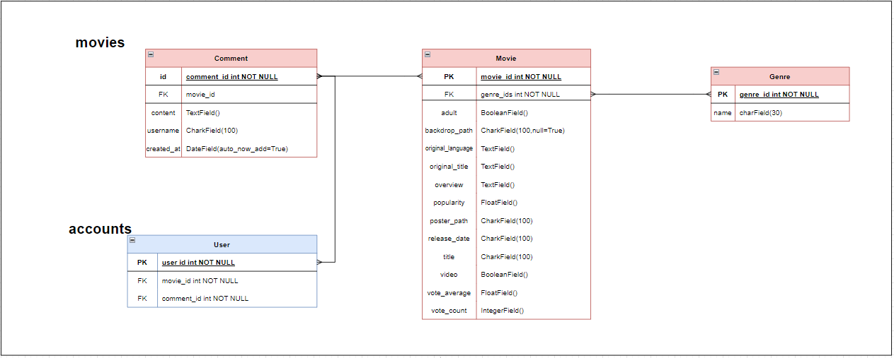
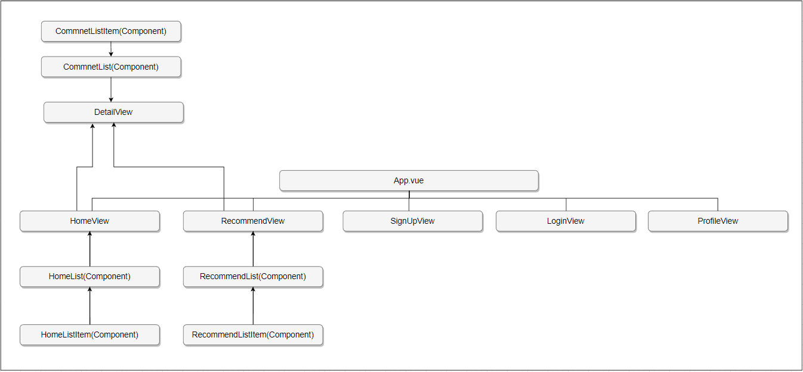
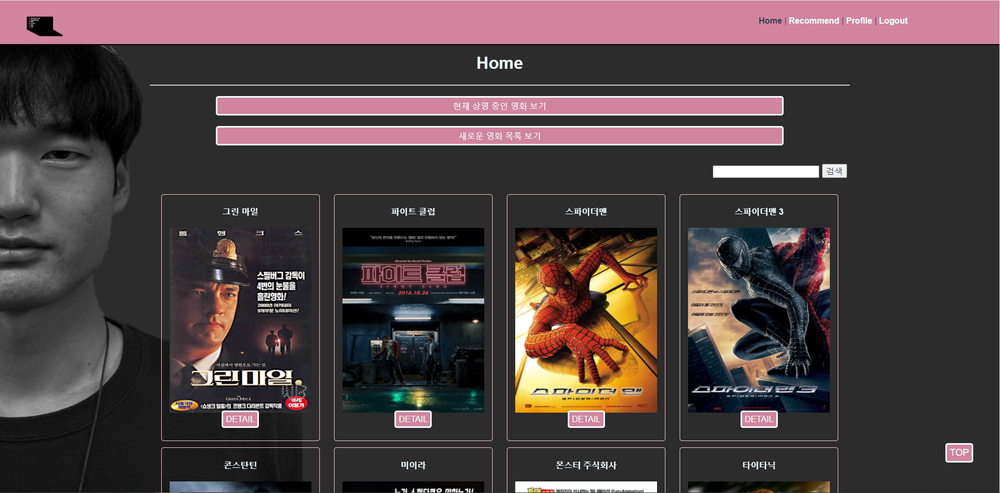
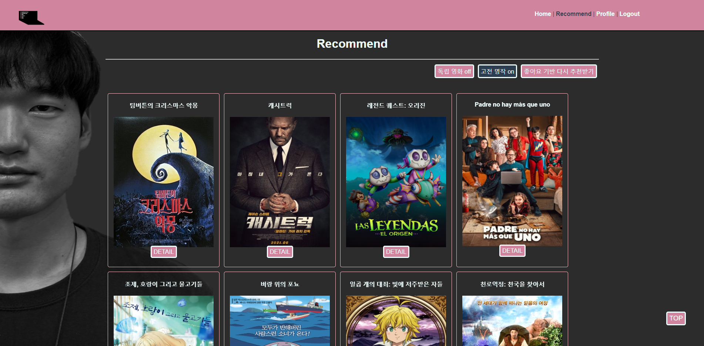
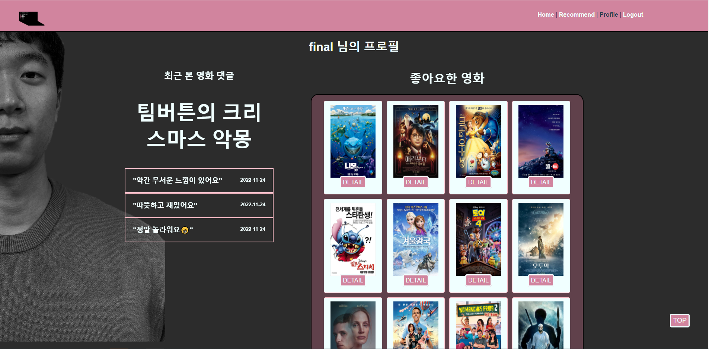

# SSAMFY (**S**eungkyu **S**ongsub **A**nd **M**ovie **F**or **Y**ou)


### 팀장 유승규

- ERD 작성
- Vue Component 설계 및 routing
- Django 기능 개선
- 프로젝트 관리 및 UI 데이터 개선

#### 연혁

> **한국 원자력 연료 총무팀 인턴 20.07**
>
> **충남대학교 경제학과 학사 취득 22.02**
>
> > **현 SSAFY 8기**

<br/>

```
<!-- 회고 -->

<ul>
    <li> 사용자가 보기에 과하게 화려하고 정보에 집중할수 없는 UI를 구성하지 않도록 노력하였습니다. </li>
    <li> 관심있는 장르라면 다양한 장르의 조합을 보여주기 위해 데이터상의 모든 장르를 고려하였습니다. </li>
    <li> 인기있고 편중된 영화가 아닌 폭넓은 영화감상의 기회를 위해 고전작품이나 독립영화작품을 고려할수있도록 하였습니다. </li>
    <li> 사용자가 다시 재방문 하고싶은 사이트가 되기위해 간단하면서도 필요한 기능만을 갖추도록 노력하였습니다. </li>
</ul>


<p>그동안 배운것을 활용하려 많이 노력했지만 스스로 부족한 점이 많다는 것을 절실하게 느꼈던 프로젝트였다. 어느 부분하나에서도 자신있게
코드를 짜지못하고 이게 맞나?라는 의심을 스스로 하며 항상 걱정이 앞서서 프로젝트를 초기진행 했었다. 그래도 잘 맞는 팀원을 만나 서로 격려도
해주고 서로가 자신있는 부분은 좀 더 노력해서 잘 하고 부족한 부분은 같이 집중하고 고민해서 문제를 풀어나가며 노력하면서 자신감을 되찾아
갔다. 하다보니 초기의 목표랑은 조금 다른 결과물이 나온듯 하지만서도 중간중간 상황을 점검하고 다시 계획을 세우면서 최종목표에 대한 계획도
자연스럽게 수정이 되어 언제나 당시의 상황에 가장 걸맞는 결과물들을 찾아낼 수 있었다. 프로젝트를 진행할수록 욕심도 생겼고 처음부터 시간이 다시
주어져서 할수 있다면 지금보다는 훨씬 좋은 결과를 가질 수 있을거라는 자신이 들었다.</p>
```

<br/>


### 팀원 김송섭

- 데이터 정제
- Django DB - Vue 연동
- Django 서버 관리 및 유지보수
- UI / UX
- CSS 구성 및 개선

#### 연혁

> **GNU Systems Research Lab 인턴 수료 21.12**
>
> **국립경상대학교 항공우주 및 소프트웨어 공학과 학사 취득 22.02**
>
> > **현 SSAFY 8기**

<br/>

```
<!-- 회고 -->

<ul>
  <li>사용자가 원하는 정보를 보여주되 함부로 장르를 배제하지 않도록 노력하였습니다.</li>
  <li>사용자가 관심있는 영화를 따로 관리할 수 있도록 노력하였습니다.</li>
  <li>사용자가 어려워하지 않게 심플한 구조를 통해 기능을 표현하였습니다.</li>
  <li>사용자가 필요하면 영화의 정보를 더욱 상세하게 볼 수 있도록 노력하였습니다.</li>
</ul>

<p>
평소 공부하던 내용으로 실제 서비스를 구현하면서 설레임이 있는 개발을 할 수
 있었습니다. 자칫 미숙한 협업 과정에서 서로 간에 의사소통이나 개발 과정에서
 불편함을 겪을 수도 있었지만 최근 navigator와 driver 역할을 경험해본 것이 큰 도움이 되었습니다.
  저를 깨는 과정을 거듭하면서 스스로 부족한 점을 깨닫는 시간이었습니다.
</p>
```

#

## 대표 서비스

- 사용자의 좋아요를 통한 영화 목록 관리
- 좋아요를 통한 알고리즘 기반 영화 추천

#

## 핵심 기능

- 영화 추천 알고리즘

  - 각 영화에 좋아요 버튼을 통해 사용자의 좋아요 정보를 수집한다.
  - 영화에 해당하는 장르에 가중치를 주고 좋아요의 수에 따라 점수를 합산한다.
  - 합산한 점수를 기준으로 높은 점수대를 모아 랜덤으로 표시한다.
  - 각 장르마다 어느정도 가중치를 가지고 있으므로 좋아요한 장르에 편향된 데이터들이 아닌 균형있는 영화를 보여줄 수 있다.

  ```js
  // final-pjt-front/src/components/RecommendList.vue

  bringLike() {
      this.algoList = [];
      axios({
        method: "get",
        url: `http://127.0.0.1:8000/accounts/liked/${this.username}/`,
      })
        .then((res) => {
          this.likeList = res.data.liked_movie;
          // liketList에 해당하는 각각의 장르들을 저장(like_genres)
          for (const movie of this.movies) {
            if (this.likeList.includes(movie.id)) {
              this.like_genres.push(...movie.genre_ids);
            }
          }
          // 여기서 for문을 통해 전체 장르(movie_genres)에서 좋아하는 장르(likeList.movie.genre_ids)에 점수를 주고싶음.
          for (const like_genre of this.like_genres) {
            this.movie_genres[like_genre] += 5;
          }
          // 그 점수를 기반으로 새로운 리스트 정렬한 기준 완성.
          let movieScore = -1;
          for (const movie of this.movies) {
            movieScore = 0;
            for (const genreId of movie.genre_ids) {
              movieScore += this.movie_genres[genreId];
            }
            movieScore = parseInt(movieScore / movie.genre_ids.length);
            this.algoList.push({
              movieScore: movieScore,
              id: movie.id,
              title: movie.title,
              poster_path: movie.poster_path,
              release_date: movie.release_date,
              vote_average: movie.vote_average,
              vote_count: movie.vote_count,
            });
          }
          this.algoList.sort((a, b) => b["movieScore"] - a["movieScore"]);
          this.algoList = _.sampleSize(this.algoList.slice(0, 300), 100);
        })
        .catch((err) => {
          console.log(err);
        });
    },
  ```

  <br/>

- 필터 기능

  - 영화의 투표 수, 평점 등을 토대로 고전 명작 / 독립 영화를 추려서 사용자가 원하는 정보만 보여준다

  ```html
  <!-- final-pjt-front/src/components/RecommendListItem.vue -->

  <div
    class="wrap-recommend-item movie-card"
    v-if="
        isClassic === true &&
        movie.release_date.slice(0, 4) < 2022 &&
        movie.vote_average > 7.5 &&
        isIndependent === true &&
        50 < movie.vote_count &&
        movie.vote_count < 200 &&
        movie.vote_average > 7
      "
  ></div>
  ```

#

### How to Start

- requirements
  - Python 3.9.x
  - Django 3.2.x
  - Node.js 16.x
  - Vue 2

<br/>

- Vue (front)

  - final-pjt/final-pjt-front
    - `$ npm install`
    - `$ npm run serve`

- Django (back)
  - final-pjt/final-pjt-back
    - `$ pip install -r requirements`
    - `$ python manage.py makemigrations`
    - `$ python manage.py migrate`
    - `$ python manage.py loaddata genres.json after_movies.json`
    - `$ python manage.py runserver`

#

### ERD



### Component



<br/>

## HomeView



## RecommendView



## ProfileView


